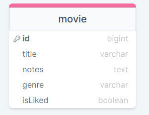
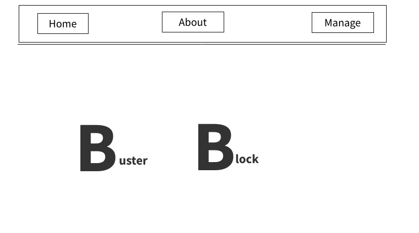
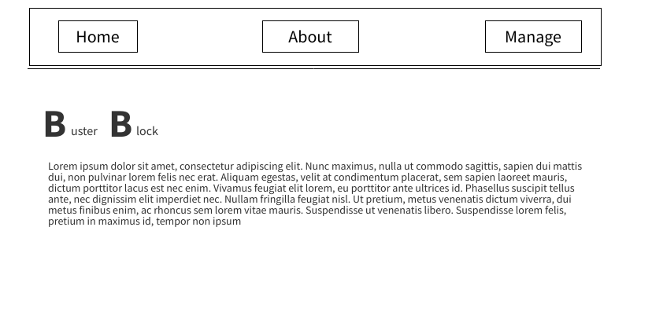
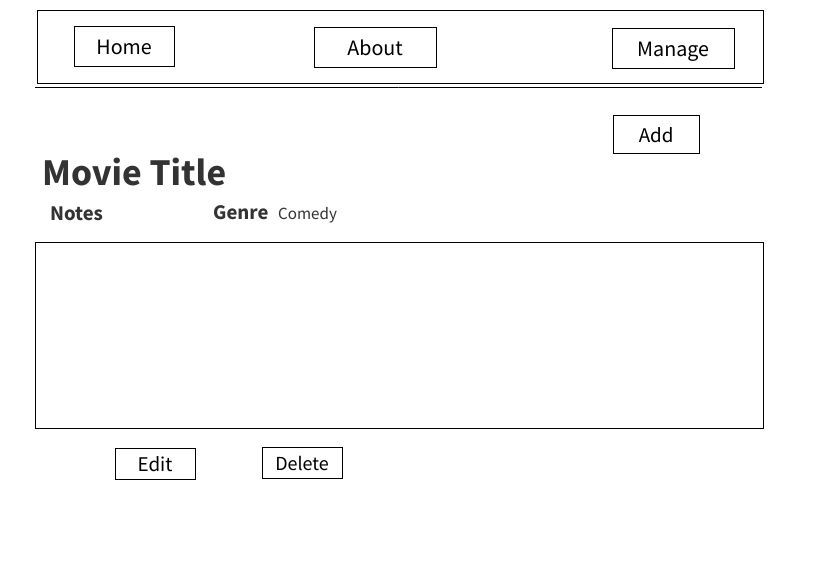

# My Project 2
## Buster Block Movie Application

### Description of the Application
Buster Block is an application to track the movies that you watch. Users can add, edit, and delete entries.

### Technologies Used
- JavaScript
- HTML
- CSS
- EJS
- Express
- Mongoose
- MongoDB

### Getting Started

### Link to Planning Trello Board
[TRELLO BOARD](https://trello.com/invite/b/a9GcuZ4w/ATTIf4d97675c351f9d73d98eb80080b6f33DF111865/project-2)

### ERD

### Mockups - Mockflow

### Next Steps